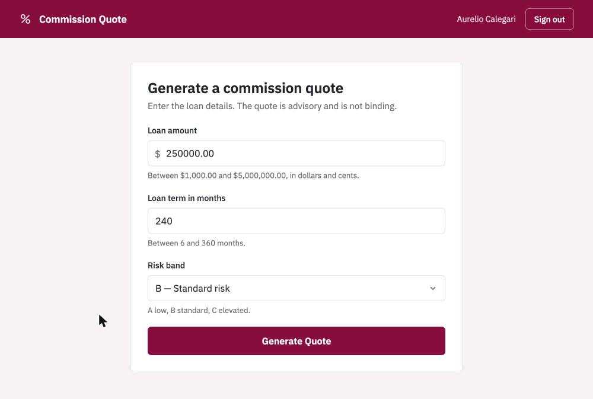
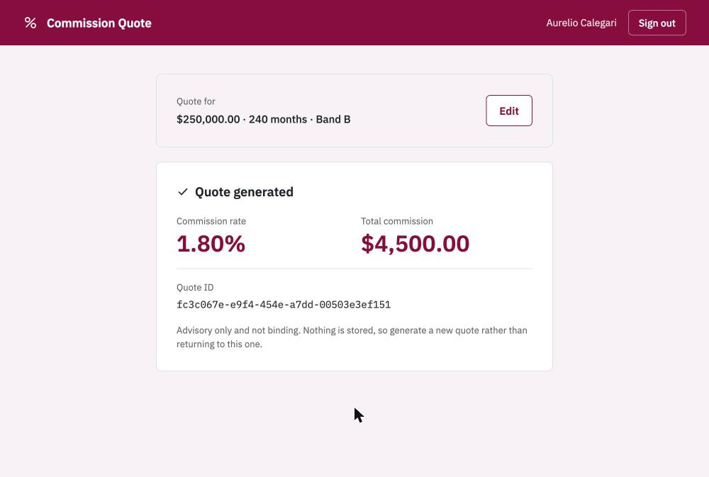
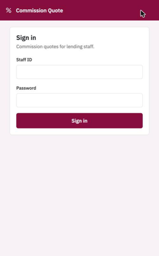
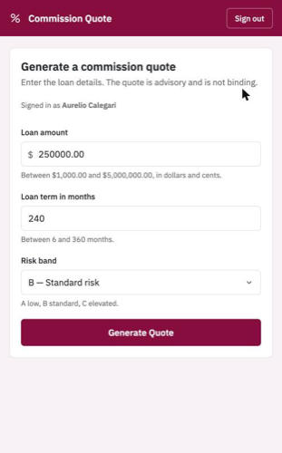
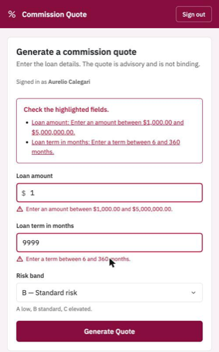
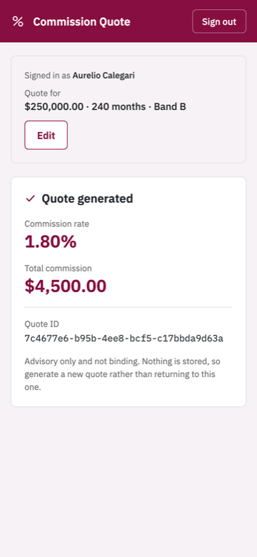

# Commission Quote App

Full-stack take-home: a web app that captures loan details and returns a commission quote from a
mocked external vendor API.

<p align="center">
  
  
</p>

<p align="center">
  
  
  
  
</p>

> Screenshots of the running application, taken end to end through the real stack: a real session, a
> real quote from the mocked vendor, real quote identifiers. Every state is drawn in the
> [design canvas](tasks/CQ-07.1/plan.md) first, seventeen artboards on desk and phone, with the
> [tokens](design/screenshots/design-tokens.png) and their measured contrast ratios.

> Status: complete. `docker compose up` runs the whole stack on one origin.

| Built                                                    | Not yet                                         |
|----------------------------------------------------------|-------------------------------------------------|
| Vendor mock, Middleware, resilience, BFF, design handoff | Web front end (CQ-07), Edge and compose (CQ-08) |

## Documents

| Document                                               | Holds                                                                                           |
|--------------------------------------------------------|-------------------------------------------------------------------------------------------------|
| [assumptions.md](design/assumptions.md)                | Assumptions, design decisions, scope, delivery tiers                                            |
| [contract.md](design/contract.md)                      | Schemas, validation rules, commission formula, error taxonomy, resilience budgets, auth, config |
| [register.md](tasks/register.md)                       | Task register, one PR per task                                                                  |
| [cqapi.openapi.yaml](api/cqapi.openapi.yaml)           | The vendor's published contract                                                                 |
| [middleware.openapi.yaml](api/middleware.openapi.yaml) | Our published contract                                                                          |
| [design/canvas/](design/canvas/)                       | Design canvas sources, one artboard per state                                                   |

`assumptions.md` is the *why*. `contract.md` is the *what*, and is what the code is tested against.

## Architecture

Five components behind a single browser visible origin. The front end never reaches the Middleware,
and the vendor `api-key` never leaves the Middleware.

| Component     | Stack       | Port     | Owns                                                                                       |
|---------------|-------------|----------|--------------------------------------------------------------------------------------------|
| Edge          | nginx       | 8080     | Single origin, serves FE assets with SPA fallback, routes `/api`                           |
| Web Front End | React, Vite | via Edge | Form, inline validation, loading, error and result states                                  |
| BFF           | Go          | 8081     | Staff session cookie, cookie to bearer exchange, user facing error wording                 |
| Middleware    | Go          | 8082     | Claim verification, entitlement, authoritative validation, resilience, holds the `api-key` |
| cqapi-mock    | Go          | 8083     | Stand in for the vendor: contract, `api-key` enforcement, failure and latency injection    |


## Repository structure

```
api/          published OpenAPI contracts
cmd/
  cqapp-middleware/  middleware entry point                (CQ-04)
  cqapp-bff/         BFF entry point                       (CQ-06)
  cqapi-mock/        vendor stand in, named for what it is (CQ-03)
  devtoken/          development only, see below
  devstaff/          development only, adds a staff member
internal/
  platform/         shared: logging, config, secrets, telemetry, money, http, tokens
  cqappbff/         -> cmd/cqapp-bff
  cqappmiddleware/  -> cmd/cqapp-middleware
  cqapimock/        -> cmd/cqapi-mock
web/          React SPA: components, one stylesheet, tokens
deploy/       nginx, Dockerfiles, docker compose
config/       staff.csv and credentials.csv, the identity fixtures
design/       assumptions, contract, diagram
tasks/        task register and per task plans
source/       the original challenge brief
```

Components we own carry the `cqapp-` prefix, in `cmd/` and in `internal/` alike, so a package name
says which service it belongs to. `cqapi-mock` does not carry it, because it is not ours: it stands in
for the vendor and is deleted when the real one arrives.

Directory names use a hyphen where they become an artifact, a binary, an image or a compose service.
Go package names cannot, so `cmd/cqapp-bff` pairs with `internal/cqappbff`.

## Design, Assumptions & Approach

[assumptions.md](design/assumptions.md) holds the assumptions and design decisions applied to this
project, and [contract.md](design/contract.md) holds the detail the code is tested against.

This work follows an AI first approach. For transparency I broke it into separate tasks, each with a
dedicated commit for the planned work and one for the finished task. The task register is at
[tasks/register.md](tasks/register.md); each task has a `code`, and the PR addressing it quotes that
`code` at the start of its title.

## AI usage

Required by the brief, and worth being specific about rather than general.

**The tool.** Anthropic Claude Code, which I use personally and professionally. It wrote most of the
code in this repository. I directed it, reviewed every change, and made the decisions it raised.

**How the work ran.** One task at a time from the register. For each: a plan committed first, a pause
while I read it, then the implementation. Every design decision that could reasonably have gone
another way was argued in the PR body rather than asserted, so the reasoning is reviewable rather
than buried. The commit history is the evidence, and it is worth more than any claim I make here.

**What I changed.** The honest part. Review is where most of the value was, and the record shows it:

| I raised | It changed |
|---|---|
| The scope check was circular: the BFF minted the token and wrote its own scope into it | Entitlement moved behind a port the Middleware owns, so a compromised BFF cannot grant itself access |
| Staff were hard coded, and the BFF would need the same list | A `config/staff.csv` fixture both read, then credentials split into their own file the Middleware never loads |
| The Middleware's error messages read like UI copy | Messages state the condition; the BFF owns user wording |
| Names were inconsistent across `cmd/`, `internal/` and the Makefile | One rule, applied everywhere, and written down so the next name follows it |
| No TLS support | The gap that mattered was outbound: the vendor `api-key` could have crossed the network in clear, and startup now refuses it |
| On a phone the result sat below the fold | The form collapses in place |
| Moving the result above the form made the panel jump | Order fixed, only height changes |
| Service unavailable had two buttons doing the same thing | One primary action per screen |
| Only four states had phone artboards | Every state has one |

**What it caught that I did not.** Tests found a whitespace-only subject authenticating, a service
logging "listening" before it had bound a port, `.env` leaking into `make test`, and a decoder
accepting a quoted `"1000"` into a numeric field. Each is recorded in the commit that fixed it.

**What I would tell you in the room.** The design canvas was wrong four times before it was right,
and every one of those was caught by looking at it rather than by reasoning about it. The parts I
would most want to walk through are the retry rule, where a `500` is deliberately not retried because
the vendor is not idempotent, and the entitlement seam, because it is the one place the first design
was wrong in a way that would have passed review.

## Getting started

First time here? [PREREQUISITES.md](PREREQUISITES.md) installs Docker, Go and Node on macOS, step by
step.

### The whole stack, one command

```sh
docker compose -f deploy/compose.yaml up --build     # or: make up
```

Then open **http://localhost:8080** and sign in as `staff-001` with `demo-password`.

That is everything: the front end, the Edge, the BFF, the Middleware and the vendor mock. No `.env`
needed, since compose carries development defaults. `make down` stops it.

Only the Edge publishes a port. The Middleware and the vendor mock are reachable on the compose
network and from nowhere else, which is the isolation the design claims.

### Or run the services natively

For working on the code. Needs Go and Node.

```sh
make env                     # writes .env from .env.example, development values only
```

Four terminals, or background them:

```sh
make run-cqapi-mock          # vendor stand in, port 8083
make run-cqapp-middleware    # middleware,      port 8082
make run-cqapp-bff           # bff,             port 8081
make run-cqapp-web           # front end,       port 5173
```

Then open **http://localhost:5173**. The Vite dev server proxies `/api` to the BFF, standing in for
the Edge.

`.env` is gitignored. Nothing in `.env.example` is a secret; in a deployed environment every value
comes from the secret manager through the same `SecretProvider` interface.

### Or drive the API directly

The development password for every fixture row is `demo-password`, stated in
[config/credentials.csv](config/credentials.csv).

```sh
curl -s -c jar localhost:8081/api/session \
  -d '{"staffId":"staff-001","password":"demo-password"}'

curl -s -b jar localhost:8081/api/v1/quotes \
  -d '{"loanAmount":250000.00,"loanTermInMonths":240,"riskBand":"B"}'
```

```json
{
  "quoteId": "7c4677e6-...",
  "commissionRate": 0.0180,
  "totalCommission": 4500.00
}
```

Staff are listed in [config/staff.csv](config/staff.csv), which stands in for the identity provider,
and their credentials in [config/credentials.csv](config/credentials.csv), which only the BFF reads.
`make dev-staff ARGS='-id staff-004 -name "Jane Doe"'` adds a member, prompting for a password and
hashing it.

Things worth trying:

```sh
# staff-002 signs in fine, but holds no scopes            -> 403
curl -s -c jar2 localhost:8081/api/session -d '{"staffId":"staff-002","password":"demo-password"}'
curl -s -b jar2 localhost:8081/api/v1/quotes -d '{"loanAmount":250000.00,"loanTermInMonths":240,"riskBand":"B"}'

# a wrong password and an unknown staff id are the same answer
curl -s localhost:8081/api/session -d '{"staffId":"staff-001","password":"wrong"}'
curl -s localhost:8081/api/session -d '{"staffId":"nobody","password":"demo-password"}'

# every invalid field at once                             -> 400
curl -s -b jar localhost:8081/api/v1/quotes -d '{"loanAmount":1,"loanTermInMonths":9999,"riskBand":"Z"}'

# signing out invalidates the session server side         -> 401 afterwards
curl -s -b jar -X DELETE localhost:8081/api/session
```

The vendor mock fails 15% of requests and stalls another 10% past the Middleware's budget, because
the challenge asks it to misbehave. The Middleware absorbs most of that; set `CQAPI_FAILURE_RATE=0`
in `.env` to stop it entirely.

`make dev-token` still mints a bearer for calling the Middleware directly on port 8082, without the BFF.

## Testing

```sh
make test      # go test -race ./...
make test-web  # front end tests
make cover     # coverage per package
make lint      # go vet, then golangci-lint if installed
make check     # fmt, vet and both suites. Run this before opening a PR
```

Tests use `httptest` fakes and never touch the network, so they do not need either service running.
`.env` is deliberately not exported into `make test`: a test that passes or fails depending on a
developer's environment is worse than no test.

## Make targets

```sh
make help
```

Every target is named after the thing it acts on, so `cmd/cqapp-bff` is `make run-cqapp-bff`.
Development only tools carry a `dev-` prefix.

| Target                                                    | Does                                                         |
|-----------------------------------------------------------|--------------------------------------------------------------|
| `env`                                                     | Create `.env` from `.env.example`                            |
| `run-cqapi-mock`, `run-cqapp-middleware`, `run-cqapp-bff` | Run one service natively                                     |
| `dev-staff`                                               | Add a staff member, prompting for a password                 |
| `dev-token`                                               | Print a bearer token, to call the middleware without the BFF |
| `build`                                                   | Build every service into `bin/`                              |
| `test`, `cover`, `vet`, `lint`, `check`                   | See above                                                    |
| `fmt`, `tidy`, `clean`                                    | Housekeeping                                                 |
