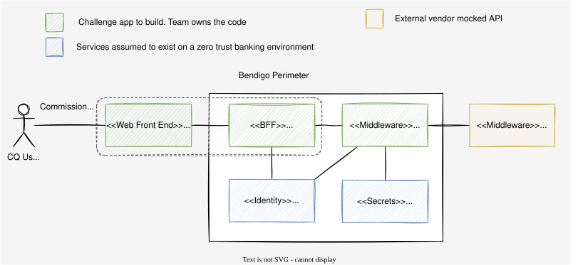

# Commission Quote App

This document outlines design assumptions I made based on the information provided on the challenge document. I'll use
the following abbreviations:

- **CQApp**: The app being built (Commission Quote App).
- **CQAPI**: The vendor system CQApp returns quotes from.
- **FE**: Web Front End.
- **BFF**: Backend for the Front End.

This document holds the *why*. The implementation level detail it drives (schemas, validation rules,
the commission formula, the error taxonomy, resilience budgets, configuration) lives in
[contract.md](contract.md).

## Functional Requirements

Key assumptions: It's a banking setting, and therefore zero trust between services is the posture, therefore every
component should verify the claims of the caller. No unprotected resources. The CQApp will have some form of user
authentication without which no access should be allowed.

1. The user is a Staff member. No technical users or admins. View only.
2. Clean, reactive interface is desirable.
3. [Assumption] The Staff member will be able to authenticate with CQApp.
4. [Assumption] The Staff member will have the pre-configured access to request a quote.
5. [Assumption] No persistence is required on the CQApp. It's a stateless application.
6. [Assumption] Single currency (AUD). No localisation.
7. [Assumption] A quote is advisory and not binding. No quote lifecycle, no expiry, no audit store in the MVP.

## Non-Functional Requirements

Key assumptions: No mention of access control, which as per mentioned above is assumed it's a given, expected in a
banking system (internal or external).

1. System resilience:
    1. UI should survive backend crashes, API unavailability, degraded performance.
    2. Requests to the backend will implement exponential backoff, bounded as per the budgets in *Resilience Budgets*
       below.
    3. Requests that hang for an arbitrary amount of time will be terminated to preserve system resources.
    4. [Assumption] Quote generation is not idempotent at the vendor. Retries restricted to failures where
       no quote has been returned.
    5. [Assumption] Quotes are not binding, if one is generated but we have not received from CQAPI (e.g. timeout) a
       new quote will be regenerated upon a succesful request.
2. Monitoring and Observability:
    1. [Assumption] No mention but an expected feature on any banking system. The following items will be added:
        1. Structured logging, adding key information such as component, method, line, message and level (e.g. info,
           error, etc).
        2. Open Telemetry: Propagation of trace and span ids across systems (embedded on requests) to aid e2e
           monitoring.
    2. No PII and no secrets in logs. `loanAmount` is business data, not PII, and is logged; the `api-key` and any
       bearer token are never logged.
    3. [Assumption] Open Telemetry will be supported and traces injected and propagated across requests. At this stage
       there's no collectors though.
3. Security:
    1. [Assumption] Zero trust environment: Backed by the bare bones of this simple app, is access verification at every
       step.
    2. [Assumption] Connections are encrypted.
    3. [Assumption] System accessed from within Bendigo's perimeter. No public access.
    4. The vendor `api-key` is a server side secret. It is held by the Middleware only. It is never present in FE
       bundles, never in a BFF response, and never crosses the browser boundary. See *API Key Handling*.
    5. Staff identity (OIDC) and vendor authentication (`api-key`) are two separate concerns and are not conflated. The
       first authorises the caller into CQApp, the second authenticates CQApp to the vendor.
    6. The browser sees a single origin, terminated by the Edge, which serves the FE assets and routes `/api` to the
       BFF.
    7. Web semantics stop at the BFF. It exchanges the browser session (cookie) for a bearer claim. The
       Middleware is completely shielded from the FE.
4. Scalability & Performance: Not mentioned but assumed can be managed at infrastructure level (e.g. auto-scaling,
   components health check). Front end is a React SPA built with Vite, kept lean so load times stay low.

### Resilience Budgets

Referenced by Non-Functional Requirement 1.2 above. The policy:

1. Budgets nest. Each caller's timeout exceeds its callee's total budget, so the innermost layer
   reports the specific failure instead of an outer layer reporting a generic timeout.
2. Retries are bounded in both attempts and total elapsed time, with exponential backoff and full
   jitter.
3. A retry is only permitted where the failure proves no quote was created at the vendor. A vendor
   `500` is ambiguous and is therefore not retried.
4. Every hop has a hard timeout. Nothing hangs indefinitely.

The values are in [contract.md](contract.md) section 6, kept there so they can be tuned without
reopening this document.

## Scope

The table below splits what is built from what is documented as the production step.

| Concern       | In scope for the MVP                                                                          | Production step                                                       |
|---------------|-----------------------------------------------------------------------------------------------|-----------------------------------------------------------------------|
| Web Front End | React SPA, form, loading, error and result states                                             | Design system, accessibility audit, localisation                      |
| Middleware    | Go service, session check, validation, commission orchestration, api-key, resilience, OpenAPI | Claim verification against the real IdP or mesh identity, rate limiting |
| BFF           | Tiny Go binary, session cookie, proxy to Middleware                                           | OIDC authorisation code flow, distributed session store               |
| Mocked CQAPI  | Standalone Go binary, api-key enforcement, random failures, latency injection                 | Deleted, replaced by the vendor plus contract tests against their sandbox |
| Edge          | nginx, single origin, TLS termination point, serves FE assets with SPA fallback, routes `/api` | Managed certificates, WAF, CDN for static assets                      |
| Staff auth    | `AuthProvider` interface with a fake in-memory Staff session                                  | OIDC against the bank IdP behind the same interface                   |
| Secrets       | `SecretProvider` interface reading env vars                                                   | Bank secret manager behind the same interface, rotation               |
| Observability | Structured JSON logs, correlation id propagation, open telemetry traces                       | OTLP collector, dashboards, alerting, SLOs                            |
| Persistence   | None, stateless                                                                               | Audit store, only if quotes ever become binding                       |

### Delivery Tiers

The challenge sets a 4 hour timebox. The scope above is wider than that, so each item carries a tier.
Core ships or the submission is incomplete. Depth ships if time holds. Documented only is specified
here and deliberately not built.

| Item                                          | Tier            |
|-----------------------------------------------|-----------------|
| Mocked CQAPI with api-key and random failures | core            |
| Validation, both sides, with the edge cases   | core            |
| Error taxonomy and safe user messages         | core            |
| Timeouts and bounded retries                  | core            |
| BFF session and cookie to bearer exchange     | core            |
| FE form with loading, error and result states | core            |
| Edge, compose, README run instructions        | core            |
| Structured JSON logging with key masking      | core            |
| Core unit tests per component                 | core            |
| Circuit breaker                               | depth           |
| OpenTelemetry spans and propagation           | depth           |
| OpenAPI contract test                         | depth           |
| Accessibility and responsive polish           | depth           |
| Real OIDC, secret manager, persistence        | documented only |
| Rate limiting, collectors, dashboards         | documented only |

Honest note on the timebox: the breaker and tracing are the two items most likely to be cut. They
are specified so the intent is legible even if the code is not there.

### Testing

Not mentioned above but graded by the challenge, so stated here: table driven Go unit tests with
`httptest` fakes and no network, a validation table covering every edge case, resilience tests
against a fake vendor, and FE tests on validation and state rendering. Randomness and time are
injected so tests are deterministic. Detail in [contract.md](contract.md) section 10.

## Design

The core application **CQApp** is broken into 3 blocks:

- **Web Front End (FE)**: React SPA built with Vite, for minimum load time and browser processing.
- **Backend for the Front End (BFF)**: Tiny Go binary, browser facing. It owns the staff session, handles friendly
  errors for the UI and access the Middleware after user authentication. It holds no business logic, no vendor
  credential.
- **Middleware**: Internal Golang service deployed on Bendigo's service mesh (assumed) that orchestrates access to the
  external CQAPI system. It verifies client claims before calling the vendor system. This system will expose an Open API
  file. The MVP version will look very similar to the vendor spec. Over time they might diverge, especially if the
  vendor is replaced, or additional functionality is built in the middleware to augment the capabilities of the service.

In front of the three sits the **Edge** (nginx). It is the published origin, serves the built FE assets with SPA
fallback, and routes `/api` to the BFF. The middleware and CQAPI are not reachable through the front end reverse proxy.

### Component Responsibilities

| Component      | Owns                                                                        |
|----------------|-----------------------------------------------------------------------------|
| Edge           | SPA and static asset serving, routing to `/` and `/api`                     |
| FE             | Input forms, inline validation for feedback, presentation formatting        |
| BFF            | Session cookie, credential exchange, error handling for the UI              |
| Middleware     | Claim verification, authoritative validation, retries, and circuit breaking |
| CQAPI (mocked) | Vendor contract, api-key enforcement, failure simulation                    |

### API Key Handling

The challenge states the CQAPI must require an `api-key` header and reject any request without a valid key. Design
consequences:

1. The key is injected into the Middleware as `CQAPI_API_KEY` via the `SecretProvider`. In production this resolves from
   the bank's assumed secret manager.
2. The Middleware attaches `api-key: <value>` on every outbound call to CQAPI.
3. CQAPI rejects a missing key and an incorrect key identically.
4. If the middleware fails to authenticate with the backend, it must report an error for the caller that's not security
   related, but log the auth issue.
5. The key will be masked on logs so we can identify the trailing for a pattern.

